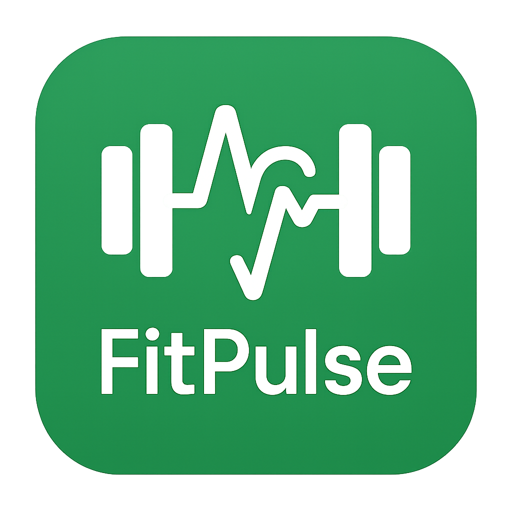

# FitPulse - React Native Fitness Tracker App

  
  
  **A comprehensive fitness tracking application built with React Native and Expo**
  
  
  
  
  

## 📱 About FitPulse

FitPulse is a modern, intuitive fitness tracking application that helps users manage their workouts, track progress, and maintain a healthy lifestyle. Built with React Native and Expo, it provides a seamless cross-platform experience for both iOS and Android users.

## ✨ Features

### 🏋️ Workout Management
- **Pre-built Workouts**: Access a variety of pre-designed workout routines
- **Custom Workout Builder**: Create personalized workout plans
- **Exercise Library**: Comprehensive database of exercises with visual guides
- **Real-time Timer**: Built-in workout and rest timers

### 📊 Progress Tracking
- **Statistics Dashboard**: Detailed analytics of your fitness journey
- **Workout History**: Track completed workouts and progress over time
- **Performance Metrics**: Monitor improvements and achievements

### 🎯 User Experience
- **Onboarding Flow**: Smooth introduction for new users
- **Profile Management**: Personalized user profiles and settings
- **Responsive Design**: Optimized for various screen sizes
- **Offline Support**: Core functionality works without internet

### 🎨 Exercise Categories
- **Strength Training**: Weight lifting and resistance exercises
- **Cardio**: Running, jumping, and cardiovascular activities
- **Flexibility**: Yoga poses and stretching routines
- **HIIT**: High-intensity interval training workouts

## 🚀 Getting Started

### Prerequisites

Before running the project, ensure you have the following installed:

- **Node.js** (version 18 or higher)
- **npm** or **yarn**
- **Expo CLI**: `npm install -g @expo/cli`
- **iOS Simulator** (for iOS development) or **Android Studio** (for Android development)

### Installation

1. **Clone the repository**

git clone https://github.com/Deeppatel3522/fitness-app.git

cd fitness-app/FitPulse

2. **Install dependencies**

npm install

3. **Start the development server**
 
 npm start

4. **Run on device/simulator**
**iOS**

npm run ios

5. **Android**

npm run android

## 📁 Project Structure

FitPulse/

├── 📱 App.js # Main application component

├── 📄 app.json # Expo configuration

├── 🎨 assets/ # Images, icons, and static files

│ ├── images/exercises/ # Exercise demonstration images

│ ├── icon.png # App icon

│ └── splash-icon.png # Splash screen icon

├── 🧩 src/

│ ├── 🧱 components/ # Reusable UI components

│ │ ├── ExerciseItem.js # Individual exercise component

│ │ ├── ProgressBar.js # Progress visualization

│ │ ├── Timer.js # Workout timer component

│ │ └── WorkoutCard.js # Workout display card

│ ├── 📱 screens/ # Application screens

│ │ ├── HomeScreen.js # Main dashboard

│ │ ├── WorkoutScreen.js # Active workout interface

│ │ ├── ProfileScreen.js # User profile management

│ │ ├── StatsScreen.js # Statistics and analytics

│ │ └── WorkoutBuilderScreen.js # Custom workout creation

│ ├── 🔧 services/ # API and data services

│ │ └── dataService.js # Local data management

│ ├── 🎛️ context/ # React Context providers

│ │ └── AppContext.js # Global application state

│ └── 📊 constants/ # Static data and configurations

│ ├── exerciseCategories.js # Exercise classification

│ └── exerciseImages.js # Image mappings

└── 🧪 tests/ # Test files

├── components/ # Component tests

├── screens/ # Screen tests

└── services/ # Service tests

## 🛠️ Technologies Used

### Core Technologies
- **React Native**: Cross-platform mobile app framework
- **Expo**: Development platform and tools
- **React Navigation**: Navigation library for React Native
- **React Context**: State management

### Development Tools
- **Jest**: Testing framework
- **ESLint**: Code linting and formatting
- **Metro**: JavaScript bundler
- **Babel**: JavaScript compiler

### UI/UX
- **React Native Vector Icons**: Icon library
- **React Native Safe Area Context**: Safe area handling
- **Custom Components**: Tailored UI components

## 📜 Available Scripts

In the project directory, you can run:

### Development
- `npm start` - Start the Expo development server
- `npm run ios` - Run on iOS simulator
- `npm run android` - Run on Android emulator
- `npm run web` - Run in web browser

### Testing
- `npm test` - Run the test suite
- `npm run test:watch` - Run tests in watch mode
- `npm run test:coverage` - Generate test coverage report

### Building
- `npm run build` - Create production build
- `eas build --platform ios` - Build for iOS (requires EAS)
- `eas build --platform android` - Build for Android (requires EAS)

## 🏃‍♂️ Exercise Library

FitPulse includes a comprehensive exercise library with visual guides:

### Strength Training
- Push-ups, Pull-ups, Squats, Lunges
- Deadlifts, Planks, and more

### Cardio
- High Knees, Jumping Jacks, Burpees
- Mountain Climbers, Sprint Intervals

### Flexibility & Recovery
- Yoga poses (Child's Pose, Warrior Pose, Downward Dog)
- Stretching routines

## 🎨 App Theming

The app uses a consistent color scheme:
- **Primary Color**: `#4CAF50` (Green)
- **Background**: Clean, minimalist design
- **Typography**: Clear, readable fonts
- **Icons**: Intuitive vector icons throughout

## 🧪 Testing

The project includes comprehensive tests:

Run all tests
npm test

Run tests with coverage
npm run test:coverage

Run tests in watch mode
npm run test:watch

text

Test coverage includes:
- Component rendering and interaction
- Screen navigation and functionality
- Service layer operations
- Context state management

## 📱 Platform Support

| Platform | Status | Version |
|----------|---------|---------|
| iOS | ✅ Supported | iOS 13+ |
| Android | ✅ Supported | API 21+ |
| Web | ✅ Supported | Modern browsers |

## 🤝 Contributing

We welcome contributions to FitPulse! Please follow these steps:

1. **Fork the repository**
2. **Create a feature branch**: `git checkout -b feature/amazing-feature`
3. **Commit your changes**: `git commit -m 'Add amazing feature'`
4. **Push to the branch**: `git push origin feature/amazing-feature`
5. **Open a Pull Request**

### Contribution Guidelines
- Follow the existing code style
- Write tests for new features
- Update documentation as needed
- Ensure all tests pass before submitting

## 📄 License

This project is licensed under the MIT License - see the [LICENSE](LICENSE) file for details.

## 🙏 Acknowledgments

- **Expo Team** for the excellent development platform
- **React Native Community** for continuous improvements
- **Exercise Image Contributors** for visual assets
- **Open Source Libraries** used throughout the project

  
Built with ❤️ by the FitPulse Team

  
© 2025 FitPulse. All rights reserved.

  
  **Ready to transform your fitness journey? Let's get moving with FitPulse! 💪**

